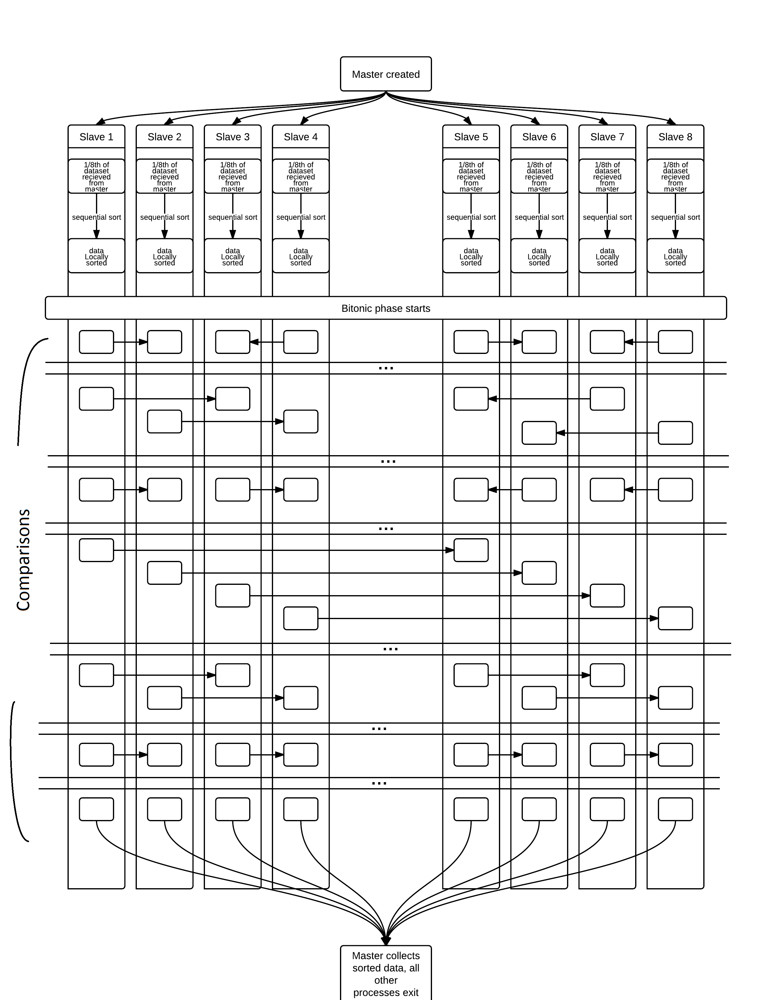

# CUDA - Bitonic Sort
IF3230 - Sistem Paralel dan Terdistribusi
Erick Wijaya - 13515057

## Deskripsi Singkat
Program ini adalah ekstensi dari program bitonic sort yang disediakan oleh asisten. 
Program ini dapat mengeksekusi bitonic sort baik secara paralel. 
Setelah sorting dilakukan, program akan mencetak waktu eksekusi 
yang dibutuhkan untuk melakukan sort secara paralel. 

## Penggunaan Program
1. Lakukan kompilasi program dengan perintah ```make```. Pastikan sudah melakukan installasi OpenMPI sebelumnya. 
2. Jalankan program dengan perintah ```mpirun -np p ./bitonic_sort n```, dengan ```n``` adalah ukuran array dan ```p``` adalah jumlah proses.
3. Hasil array sebelum dan sesudah di-sort dapat dilihat pada file ```data/input.txt``` dan ```data/output.txt```
4. Output waktu eksekusi beserta detilnya dapat dilihat pada file ```output/log.txt```

## Pembagian Tugas
Tugas ini dikerjakan oleh Erick Wijaya (13515057). 

## Laporan Pengujian
Pada bagian ini akan dijelaskan mengenai deskripsi solusi paralel yang digunakan, analisis solusi, jumlah thread, pengujian, dan analisis hasil uji. 

### Deskripsi Solusi Paralel
Sebelum dijelaskan mengenai deskripsi solusi paralel akan dijelaskan terlebih dulu mengenai deskripsi solusi bitonic sort secara umum.
Bitonic sort adalah algoritma sorting yang berjalan dengan melakukan penukaran elemen untuk membuat *bitonic sequence*, yaitu deret angka 
yang nilainya naik lalu turun, atau turun lalu naik. Proses urutan penukaran (compare) dapat dilihat pada gambar dibawah. Panah 
menunjukkan parameter penukaran elemen yaitu elemen yang ditunjuk panah harus lebih besar atau sama dengan elemen yang menunjuk. 
Bila tidak demikian, posisi kedua elemen akan ditukar. Pada iterasi pertama, dihasilkan deretan angka yang naik-turun secara berselingan. 
Pada iterasi kedua dan ketiga, elemen yang ditukar diubah sehingga hasilnya adalah deretan angka naik-turun yang frekuensi naik-turunnya (daerah berwarna biru dan hijau pada gambar) adalah
setengahnya dari iterasi pertama. Hal tersebut dilakukan berulang sampai seluruh elemen hanya naik saja, atau turun saja, dalam kata lain 
sudah terurut menaik atau menurun (tergantung parameter sort ascending atau descending). 


Solusi diatas memiliki kompleksitas sebesar ```O(N*(log N)^2)```. Kompleksitas tersebut dapat dioptimasi dengan solusi paralel. 
Karena urutan penukaran elemen pada bitonic sort selalu sama diberikan ukuran elemen yang tetap, maka algoritma paralel dapat 
diimplementasikan dengan mudah. 
Solsi paralel diterapkan dengan membagi array menjadi beberapa array kecil dengan ```MPI_Scatter``` sesuai dengan jumlah prosesnya. 
Masing-masing proses akan melakukan bitonic sort terhadap array kecil tersebut. Misalnya array memiliki ukuran 5000, apabila digunakan 
2 proses maka array dibagi menjadi 2 array berukuran 2500 sehingga masing-masing proses melakukan bitonic sort dengan ukuran 2500. 
Setelah semua proses melakukan bitonic sort, masing-masing proses bersebelahan melakukan komunikasi dengan ```MPI_Sendrecv``` untuk 
menggabungkan kedua array menjadi satu array gabungan bitonic sequence. Misalnya ada 4 proses, maka proses 0 dan 1 melakukan komunikasi 
sehingga array pada proses 0 dan 1 terurut bila digabung. Begitu pula dengan array pada proses 2 dan 3. Setelah itu, hasil array proses 0,1 
dan proses 2,3 dibandingkan untuk membentuk array dari proses 1,2,3,4 yang terurut sehingga seluruh array-array kecil sudah terurut bila 
digabungkan. Untuk menggabungkan semua array-array kecil, digunakan perintah ```MPI_Gather``` sehingga diperoleh sebuah array gabungan 
yang sudah terurut. Perintah ```MPI_Barrier``` dipanggil sebelum gather untuk menghindari penggabungan array kecil yang belum selesai 
diproses. Berikut adalah gambar yang meringkas penjelasan solusi ini. 



### Analisis Solusi
Berdasarkan solusi yang saya gunakan, waktu eksekusi bitonic sort menjadi lebih cepat dengan speedup hampir 2 kali. 

Karena paralelisasi dilakukan pada iterasi 
penukaran elemen (kompleksitasnya adalah ```O(N)```), kompleksitas iterasi tersebut menjadi lebih cepat, yaitu menjadi 
```O(N/K)``` dengan K adalah jumlah thread yang digunakan. Kompleksitas akhir algoritma menjadi ```O(N/K*(log N)^2)```. 
Solusi ini sudah cukup baik, namun bisa ditingkatkan lagi apabila ditemukan cara paralelisasi yang lebih efektif 
(misalnya dengan memparalelisasi looping pertama dan kedua dengan benar). 

Cara lain untuk mengoptimasi adalah dengan merancang algoritma bitonic sort 
yang tidak perlu mengalokasikan dan memproses elemen dummy bila ukuran array bukan kelipatan 2 (pada solusi yang saya gunakan masih 
menggunakan elemen dummy). 

### Jumlah Thread
Jumlah thread/proses yang digunakan adalah 2. Angka 2 dipilih karena berdasarkan hasil percobaan, program dengan 2 buah 
proses memiliki efisiensi lebih tinggi ketimbang dengan program yang memiliki 4 atau 8 proses atau lebih. 

### Pengukuran Kinerja (Tabel)
Berikut adalah tabel pengujian waktu untuk bitonic sort serial dan paralel, dan tabel *speedup* beserta efisiensinya.

#### Serial (1 proses)
| **Ukuran Array** | **Percobaan 1 (μs)** | **Percobaan 2 (μs)** | **Percobaan 3 (μs)** | **Rata-Rata (μs)** |
| ------------ | -------------------- | -------------------- | -------------------- | ------------------ |
| 512     |  |  |  |  |
| 1024    |  |  |  |  |
| 4096    |  |  |  |  |
| 65536   |  |  |  |  |
| 262144  |  |  |  |  |
| 1048576 |  |  |  |  |
| 8388608 |  |  |  |  |

#### Paralel (2 proses) 
| **Ukuran Array** | **Percobaan 1 (μs)** | **Percobaan 2 (μs)** | **Percobaan 3 (μs)** | **Percobaan 4 (μs)** | **Percobaan 5 (μs)** | **Rata-Rata (μs)** |
| ------------ | ------------------------ | -------------------- | -------------------- | -------------------- | -------------------- | ------------------ |
| 5000   | 1544.952393    | 1544.952393    | 1554.012299    | 1549.959183    | 1544.952393    | 1547.765732   | 
| 50000  | 27383.089066   | 20334.005356   | 30303.001404   | 30339.002609   | 18886.089325   | 25449.037552  | 
| 100000 | 69988.012314   | 57765.007019   | 59691.905975   | 44879.913330   | 59796.094894   | 58424.186706  | 
| 200000 | 100512.981415  | 130935.907364  | 136426.925659  | 118865.966797  | 113991.022110  | 120146.560669 | 
| 400000 | 205804.109573  | 223143.100739  | 253459.930420  | 247253.894806  | 218801.975250  | 229692.602158 | 

| **Ukuran Array** | **Speed Up** | **Efisiensi** |
| ---------------- | ------------ | ------------- |
| 5000             |    1.809x    |   90.451%    |
| 50000            |    1.822x    |   91.124%    |
| 100000           |    1.773x    |   88.674%    |
| 200000           |    1.631x    |   81.552%    |
| 400000           |    1.631x    |   81.551%    |

#### Paralel (4 proses) 
| **Ukuran Array** | **Percobaan 1 (μs)** | **Percobaan 2 (μs)** | **Percobaan 3 (μs)** | **Percobaan 4 (μs)** | **Percobaan 5 (μs)** | **Rata-Rata (μs)** |
| ------------ | ------------------------ | -------------------- | -------------------- | -------------------- | -------------------- | ------------------ |
| 5000   | 1594.066620    | 1003.980637    | 982.046127     | 989.913940     | 2291.917801    | 1372.385025   |
| 50000  | 39314.985275   | 30795.097351   | 21363.019943   | 23847.103119   | 32182.931900   | 29500.627518  |
| 100000 | 111895.084381  | 110778.083801  | 70276.975632   | 77461.957932   | 113548.040390  | 96792.028427  |
| 200000 | 129167.079926  | 159974.098206  | 102111.101151  | 190342.903137  | 124057.054520  | 141130.447388 |
| 400000 | 304891.109467  | 259758.949280  | 315741.062164  | 269983.053207  | 293365.001678  | 288747.835159 |

| **Ukuran Array** | **Speed Up** | **Efisiensi** |
| ---------------- | ------------ | ------------- |
| 5000             |    2.040x    |   51.005%    |
| 50000            |    1.572x    |   39.304%    |
| 100000           |    1.070x    |   26.762%    |
| 200000           |    1.389x    |   34.713%    |
| 400000           |    1.283x    |   32.087%    |

#### Paralel (8 proses) 
| **Ukuran Array** | **Percobaan 1 (μs)** | **Percobaan 2 (μs)** | **Percobaan 3 (μs)** | **Percobaan 4 (μs)** | **Percobaan 5 (μs)** | **Rata-Rata (μs)** |
| ------------ | ------------------------ | -------------------- | -------------------- | -------------------- | -------------------- | ------------------ |
| 5000   | 2218.008041    | 2367.019653    | 2515.077591    | 2334.117889    | 2430.915833    | 2373.027801   |
| 50000  | 38963.079453   | 54183.959961   | 38949.966431   | 33972.024918   | 53514.003754   | 43916.606903  |
| 100000 | 50954.103470   | 120012.044907  | 104650.020599  | 101023.912430  | 117316.961288  | 98791.408539  |
| 200000 | 144534.111023  | 103744.029999  | 102400.064468  | 102796.077728  | 104211.091995  | 111537.075043 |
| 400000 | 201124.906540  | 244997.978210  | 247999.906540  | 270179.033279  | 268702.983856  | 246600.961685 |

| **Ukuran Array** | **Speed Up** | **Efisiensi** |
| ---------------- | ------------ | ------------- |
| 5000             |    1.180x    |   14.749%    |
| 50000            |    1.056x    |   13.201%    |
| 100000           |    1.049x    |   13.110%    |
| 200000           |    1.757x    |   21.962%    |
| 400000           |    1.503x    |   18.786%    |

### Analisis Kinerja Serial dan Paralel
Berdasarkan hasil pengukuran kinerja diatas, terlihat bahwa kinerja program paralel lebih cepat daripada serial untuk semua kasus uji. 
Hasil diatas menunjukkan bahwa program dengan 2 proses memiliki *speedup* dan efisiensi tertinggi. Hal tersebut demikian karena 
pada kasus 2 proses, *overhead* lebih sedikit karena lebih sedikit context switching dan komunikasi antar proses. 
Pada kasus 4 proses maupun 8 proses, terkadang *speedup* bisa lebih tinggi dari kasus 2 proses tetapi rata-rata *speedup*-nya lebih 
rendah serta efisiensinya jauh lebih rendah dari kasus 2 proses. Efisiensi menjadi lebih kecil karena pada kasus banyak proses, lebih 
banyak resource yang digunakan. Kesimpulannya program yang saya buat paling efektif dilakukan dengan 2 proses karena efisiensinya paling 
tinggi (mencapai 80~90%). 